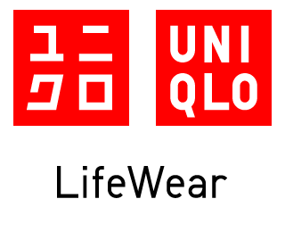

# Uniqloscraper

## What does it do?

Simple webscraper and updater system that allows me to implement a personal mail feature for favorite items list in uniqlo.

When the items in the favorites list are on discount, the script will flag it and send me a notification via Telegram. This checking feature will run a CRON once a day at 12PM Singapore Time (UTC+8). Additionally, it will write a pickle file to store SKUs from previous blast to ensure I am only notified on new items and not repeatedly every day.

This is a feature that will help me save money on working clothes and I hope its implementation means that I will only ever have to buy discounted items.

* Scrapes up to up to 20 favorite listings
* Runs CRON once a day to check
* Saves previous days output in a pk file for persistence
* Saves me money and time
* Utilises Telegram API for quick calls
* Script will have a github runtime < 15s as the only external library it utilises is requests

Future updates might include a publically hosted variation of this file to allow others the chance to do the same using the same pipeline. This could be implemented using a proper telegram bot framework.
